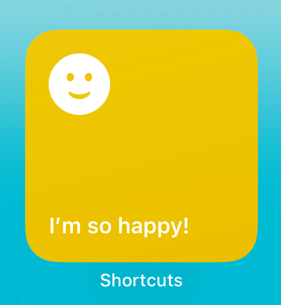
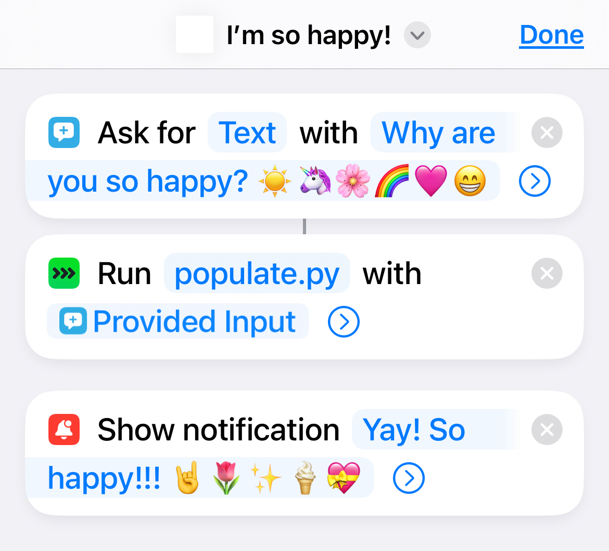
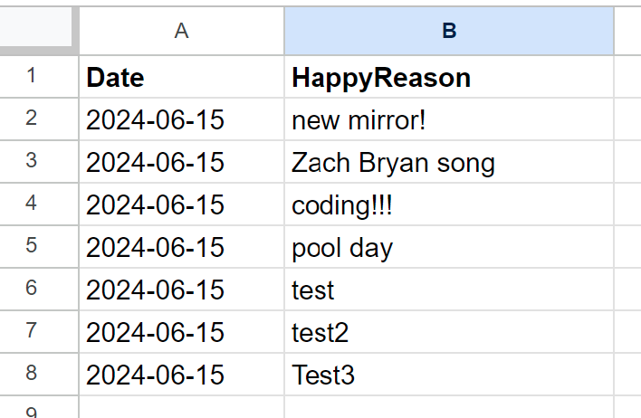
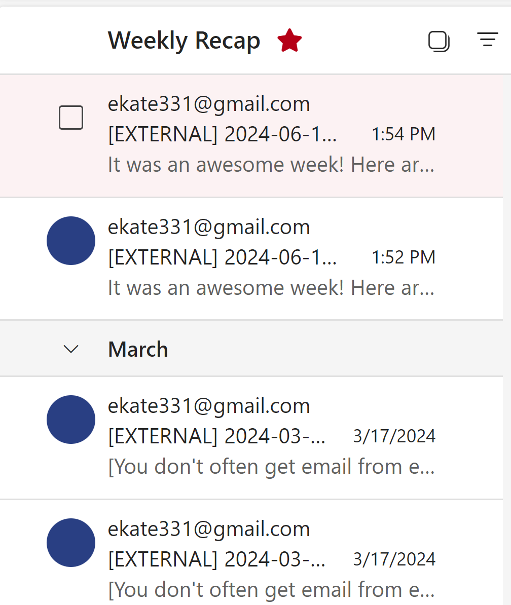

# Happiness Logging and Weekly Recap Automation

## Overview
This automation process helps you log moments of gratitude and happiness through a convenient widget on your iPhone and receive a weekly recap email summarizing these moments along with five random photos from your Google Photos. The system is designed to streamline the process of tracking positive moments and reflecting on them weekly, enhancing your mindfulness and well-being.

## Components
1. **iPhone Widget & Shortcut**: A user-friendly interface to log moments of happiness.
2. **Python Scripts**:
   - `populate.py`: Logs the happy moments to a Google Sheet.
   - `weeklyemail.py`: Sends a weekly recap email with happy moments and random photos.
3. **Google Sheet**: Stores all logged happy moments.
4. **Task Scheduler**: Runs the weekly email script on your computer.

## Logic and Flow

### 1. Logging Happiness with iPhone Widget
- **Widget Setup**: An iPhone widget named "I’m so happy!" is created using the Shortcuts app. This widget is always accessible on your home screen.

- **Shortcut Action**: When the widget is tapped, a shortcut runs asking, "Why are you so happy?" You provide a response, and the shortcut then triggers a Python script (`populate.py`) via Pyto (a Python IDE for iOS) to log this information.

### 2. Storing Data in Google Sheets
- **Python Script (`populate.py`)**: This script authenticates with Google Sheets using OAuth2. It takes the user’s input from the shortcut, along with the current date, and appends this information to a pre-specified Google Sheet. This creates a running log of all your happy moments.

### 3. Weekly Email Recap
- **Python Script (`weeklyemail.py`)**: Another script scheduled to run weekly via Task Scheduler on your computer. This script performs two key tasks:
  - **Fetch Happy Reasons**: It reads the Google Sheet to fetch all the happy reasons logged in the past week.
  - **Fetch Random Photos**: It connects to your Google Photos account and selects five random photos from the past week.
  - **Send Email**: Combines the happy reasons and photos into an email and sends it to your designated email address.

### 4. Automating the Weekly Email with Task Scheduler
- **Task Scheduler Setup**: You configure Task Scheduler on your computer to run the `weeklyemail.py` script at a specified time each week (e.g., every Sunday at 8 PM).
- **Email Delivery**: Once the script runs, it generates an email summarizing your happy moments from the past week along with five random photos, providing a delightful recap to start your week positively.

## Benefits
- **Mindfulness**: Regularly logging moments of happiness helps cultivate mindfulness and gratitude.
- **Reflection**: The weekly email recap allows you to reflect on positive moments, reinforcing positive emotions.
- **Convenience**: The iPhone widget makes it easy to log happy moments on-the-go, ensuring you never miss an opportunity to capture joy.
- **Automation**: The entire process from logging to weekly reflection is automated, requiring minimal effort from you.

## Conclusion
This automated system leverages the power of technology to enhance your well-being by making it easy to log, store, and reflect on moments of happiness. By integrating iPhone widgets, Python scripts, Google Sheets, and Task Scheduler, you create a seamless flow that supports positive mental health habits.

Feel free to customize the scripts and setup according to your preferences to make the most out of this automation!
